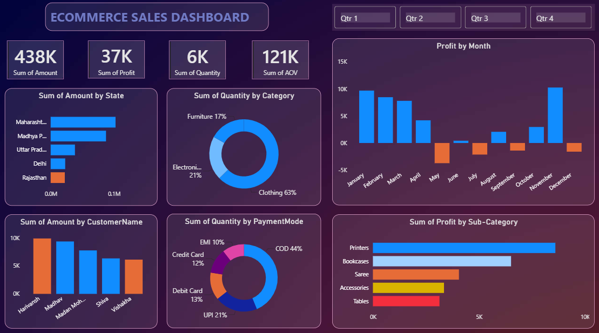

# 📊 E-Commerce Sales Dashboard | Power BI

## 📌 Project Overview

This project is an interactive **E-Commerce Sales Dashboard** created using **Microsoft Power BI**.

The dashboard analyzes e-commerce sales data to understand overall sales performance, profit, quantity, customer-wise sales, product categories, payment modes, states, sub-categories, and monthly profit trends.

The dashboard uses **Power Query, DAX, charts, cards, slicers, and interactive visualizations** to make the analysis easy to understand.

This project was created as part of my **Data Analytics learning journey**.

---

## 🎯 Business Objective

The main objective of this project is to analyze e-commerce sales data and identify useful business insights, including:

* Overall sales and profit performance
* State-wise sales performance
* Category-wise quantity distribution
* Customer-wise sales
* Payment mode usage
* Monthly profit trends
* Sub-category profitability
* Product and customer performance

---

## 🛠️ Tools & Skills Used

* Microsoft Power BI
* Power Query
* DAX
* Data Cleaning
* Data Transformation
* Data Modeling
* Data Visualization
* Dashboard Design
* Business Analysis

---

## 📊 Dashboard Analysis

### 1. 💰 Key Performance Indicators

The dashboard provides an overview of important business metrics:

* **Total Sales:** 438K
* **Total Profit:** 37K
* **Total Quantity:** 6K
* **AOV:** Displayed in the dashboard

These KPIs provide a quick overview of the overall business performance.

---

### 2. 📍 Sales by State

The dashboard analyzes the sales amount across different states.

Among the displayed states:

* Maharashtra
* Madhya Pradesh
* Uttar Pradesh
* Delhi
* Rajasthan

**Maharashtra** has the highest sales amount among the states displayed.

This analysis helps identify regions contributing significantly to overall sales.

---

### 3. 👕 Quantity by Category

The category analysis shows the contribution of different product categories to total quantity.

| Category    | Contribution |
| ----------- | -----------: |
| Clothing    |          63% |
| Electronics |          21% |
| Furniture   |          17% |

**Clothing** contributes the largest share of quantity among the three categories.

---

### 4. 👥 Sales by Customer

The dashboard compares sales amounts across customers.

The displayed customers include:

* Harivansh
* Madhav
* Madan Mohan
* Shiva
* Vishakha

This analysis helps identify customers contributing significantly to sales.

---

### 5. 💳 Quantity by Payment Mode

The dashboard analyzes quantity based on different payment methods.

| Payment Mode | Contribution |
| ------------ | -----------: |
| COD          |          44% |
| UPI          |          21% |
| Debit Card   |          13% |
| Credit Card  |          12% |
| EMI          |          10% |

**COD (Cash on Delivery)** is the most-used payment mode among the displayed payment methods.

---

### 6. 📅 Profit by Month

The monthly profit chart shows how profit changes throughout the year.

The dashboard displays both positive and negative profit values across different months.

This analysis helps identify:

* High-profit months
* Low-profit months
* Months with negative profit
* Overall monthly profit fluctuations

**November** shows one of the highest positive profit values in the displayed analysis.

---

### 7. 🖨️ Profit by Sub-Category

The dashboard compares profit across different product sub-categories.

The displayed sub-categories include:

* Printers
* Bookcases
* Saree
* Accessories
* Tables

**Printers** generate the highest profit among the displayed sub-categories.

This analysis helps identify the products contributing most to profitability.

---

## 💡 Key Business Insights

Based on the dashboard analysis:

1. **Clothing contributes approximately 63% of total quantity**, making it the largest category by quantity.

2. **COD contributes approximately 44% of quantity**, making it the most-used payment mode.

3. **Maharashtra** has the highest sales amount among the states displayed.

4. **Printers** are the highest-profit sub-category among the displayed sub-categories.

5. **November** is one of the strongest months in terms of positive profit.

6. Monthly profit fluctuates throughout the year, with some months showing negative profit values.

7. The dashboard provides a consolidated view of sales, profit, quantity, customers, categories, payment modes, and monthly performance.

---

## 🎛️ Interactive Dashboard

The dashboard includes interactive **quarter filters**:

* Qtr 1
* Qtr 2
* Qtr 3
* Qtr 4

These filters allow users to explore the dashboard based on different quarters and analyze changes in sales and profit performance.

---

## 📷 Dashboard Preview

---

## 📂 Project Files

* **[Ecommerce Sales Dashboard.pbix](Ecommerce%20Sales%20Dashboard.pbix)** — Power BI dashboard file.
* **[Details.csv](Details.csv)** — Dataset containing additional e-commerce details.
* **[Orders.csv](Orders.csv)** — Orders and sales dataset.
* **[dashboard.png](dashboard.png)** — Dashboard preview.

---

## 🚀 Learning Outcomes

Through this project, I gained practical experience in:

* Importing data into Power BI
* Cleaning and transforming data using Power Query
* Creating relationships between datasets
* Creating calculated measures using DAX
* Creating KPI cards
* Designing interactive charts
* Using slicers and filters
* Analyzing sales and profit performance
* Identifying business insights
* Creating interactive Power BI dashboards
* Presenting data through visualizations

---

## 👩‍💻 Author

**Sanya Kushwaha**

---

## ⭐ Acknowledgement

This project was created as part of my **Data Analytics learning journey** and was inspired by a guided Power BI sales analysis tutorial.

The purpose of this project was to gain practical experience with **Power BI, Power Query, DAX, data visualization, and business analysis**.
